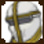
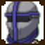
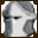
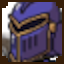

==========
Characters
==========

For drafting your team of mercenaries to win the final battle against the opposing country, you need to know who you
can hire. Here is the collection of characters available for hire. Look into them closely and draft the best team for
VICTORY!!!

*NOTE: A character's base health stat is increased by a multiplier of <multiplier number here>. This is to*
*provide reasonable health amounts for every character. When the base health is listed, the actual health*
*of the character will be listed after.*

Class Types
===============

There are three (3) class types a character can be:

=========================== =========================================================================================
Class Type                  Description
=========================== =========================================================================================
Attacker                    Focuses on dealing damage
Healer                      Focuses on healing the team/themselves
Tank                        Focuses on taking hits and retaliating
=========================== =========================================================================================

Leaders
=======

Fultra
------

=============================== =============================================================
Fultra's Character Info
=============================== =============================================================
Class Type                      Attacker
Base Health                     33
Base Attack                     50
Base Defense                    36
Base Speed                      41
=============================== =============================================================

Moveset
.......

======================== ====================================
Normal Move
======================== ====================================
Name                     Plasma Arrow
MoveType                 ATTACK
TargetType               SINGLE_OPP
SP Cost                  0
Additional Damage Points 0

Effect MoveType          BUFF
Effect TargetType        SELF
Stat Affected            ATTACK
Buff Amount              +1
======================== ====================================

======================== ====================================
Special 1
======================== ====================================
Name                     Overhaul
MoveType                 HEAL
TargetType               SELF
SP Cost                  2
Heal Points              30

Effect MoveType          DEBUFF
Effect TargetType        SELF
Stat Affected            ATTACK
Debuff Amount            -3
======================== ====================================

======================== ====================================
Special 2
======================== ====================================
Name                     Lighting Rod
MoveType                 ATTACK
TargetType               SINGLE_OPP
SP Cost                  5
Additional Damage Points 0

Effect MoveType          ATTACK
Effect TargetType        ALL_OPPS
Damage Points            20
======================== ====================================

Ninlil
------

=============================== =============================================================
Ninlil's Character Info
=============================== =============================================================
Class Type                      Attacker
Base Health                     46
Base Attack                     47
Base Defense                    37
Base Speed                      30
=============================== =============================================================

Moveset
.......

======================== ====================================
Normal Move
======================== ====================================
Name                     Little Angy
MoveType                 ATTACK
TargetType               SINGLE_OPP
SP Cost                  0
Additional Damage Points 5

Effect                   None
======================== ====================================

======================== ====================================
Special 1
======================== ====================================
Name                     Smol Rage
MoveType                 ATTACK
TargetType               SINGLE_OPP
SP Cost                  2
Additional Damage Points 10

Effect MoveType          DEBUFF
Effect TargetType        SELF
Stat Affected            Speed
Debuff Amount            -3
======================== ====================================

======================== ====================================
Special 2
======================== ====================================
Name                     Tiny Titan
MoveType                 ATTACK
TargetType               SINGLE_OPP
SP Cost                  5
Additional Damage Points 15

Effect MoveType          DEBUFF
Effect TargetType        SELF
Stat Affected            Speed
Debuff Amount            -5
======================== ====================================

Anahita
-------

=============================== =============================================================
Anahita's Character Info
=============================== =============================================================
Class Type                      Healer
Base Health                     42
Base Attack                     38
Base Defense                    30
Base Speed                      50
=============================== =============================================================

Moveset
.......

======================== ====================================
Normal Move
======================== ====================================
Name                     Whirlpool
MoveType                 ATTACK
TargetType               SINGLE_OPP
SP Cost                  0
Additional Damage Points 2

Effect MoveType          HEAL
Effect TargetType        SELF
Heal Points              15
======================== ====================================

======================== ====================================
Special 1
======================== ====================================
Name                     Empower Shower
MoveType                 BUFF
TargetType               ENTIRE_TEAM
SP Cost                  2
Stat Affected            ATTACK
Buff Amount              +2

Effect                   None
======================== ====================================

======================== ====================================
Special 2
======================== ====================================
Name                     Oasis
MoveType                 HEAL
TargetType               ADJACENT_ALLIES
SP Cost                  4
Heal Points              75

Effect MoveType          ATTACK
Effect TargetType        SELF
Damage points            20
======================== ====================================

Berry
-----

=============================== =============================================================
Berry's Character Info
=============================== =============================================================
Class Type                      Healer
Base Health                     40
Base Attack                     1
Base Defense                    50
Base Speed                      69
=============================== =============================================================

Moveset
.......

======================== ====================================
Normal Move
======================== ====================================
Name                     Healing Potion
MoveType                 HEAL
TargetType               ENTIRE_TEAM
SP Cost                  0
Heal Points              6

Effect MoveType          HEAL
Effect TargetType        SELF
Heal Points              6
======================== ====================================

======================== ====================================
Special 1
======================== ====================================
Name                     Debuff Potion
MoveType                 DEBUFF
TargetType               SINGLE_OPP
SP Cost                  1
Stat Affected            ATTACK
Debuff Amount            -2

Effect                   None
======================== ====================================

======================== ====================================
Special 2
======================== ====================================
Name                     Buffing Potion
MoveType                 BUFF
TargetType               ADJACENT_ALLIES
SP Cost                  4
Stat Affected            ATTACK
Buff Amount              +5

Effect MoveType          BUFF
Effect TargetType        SELF
Stat Affected            ATTACK
Buff Amount              +5
======================== ====================================

Calmus
------

=============================== =============================================================
Calmus' Character Info
=============================== =============================================================
Class Type                      Tank
Base Health                     60
Base Attack                     45
Base Defense                    35
Base Speed                      20
=============================== =============================================================

Moveset
.......

======================== ====================================
Normal Move
======================== ====================================
Name                     Flame Slash
MoveType                 ATTACK
TargetType               SINGLE_OPP
SP Cost                  0
Additional Damage Points 5

Effect                   None
======================== ====================================

======================== ====================================
Special 1
======================== ====================================
Name                     Flash Boost
MoveType                 BUFF
TargetType               SELF
SP Cost                  3
Stat Affected            ATTACK
Buff Amount              +4

Effect MoveType          ATTACK
Effect TargetType        SELF
Damage Points            10
======================== ====================================

======================== ====================================
Special 2
======================== ====================================
Name                     Berserk
MoveType                 BUFF
TargetType               ENTIRE_TEAM
SP Cost                  5
Stat Affected            ATTACK
Buff Amount              +15

Effect MoveType          ATTACK
Effect TargetType        SELF
Damage Points            35
======================== ====================================

Irwin
-----

=============================== =============================================================
Irwin's Character Info
=============================== =============================================================
Class Type                      Tank
Base Health                     55
Base Attack                     30
Base Defense                    50
Base Speed                      25
=============================== =============================================================

Moveset
.......

======================== ====================================
Normal Move
======================== ====================================
Name                     Striking Defense
MoveType                 ATTACK
TargetType               SINGLE_OPP
SP Cost                  0
Additional Damage Points 1

Effect MoveType          BUFF
Effect TargetType        SELF
Stat Affected            Defense
Buff Amount              +1
======================== ====================================

======================== ====================================
Special 1
======================== ====================================
Name                     Weakening Strike
MoveType                 ATTACK
TargetType               SINGLE_OPP
SP Cost                  3
Additional Damage Points 5

Effect MoveType          DEBUFF
Effect TargetType        SELF
Stat Affected            Defense
Debuff Amount            -3
======================== ====================================

======================== ====================================
Special 2
======================== ====================================
Name                     Close Combat
MoveType                 ATTACK
TargetType               SINGLE_OPP
SP Cost                  5
Additional Damage Points 10

Effect MoveType          DEBUFF
Effect TargetType        SELF
Stat Affected            Defense
Debuff Amount            -15
======================== ====================================

Generics
========

Generic Attacker
----------------

|u_atk| |t_atk|

================================= =============================================================
Generic Attacker's Character Info
================================= =============================================================
Class Type                        Attacker
Base Health                       40
Base Attack                       45
Base Defense                      30
Base Speed                        35
================================= =============================================================

Moveset
.......

======================== ====================================
Normal Move
======================== ====================================
Name                     Stab
MoveType                 ATTACK
TargetType               SINGLE_OPP
SP Cost                  0
Additional Damage Points 5

Effect                   None
======================== ====================================

======================== ====================================
Special 1
======================== ====================================
Name                     Great Stab
MoveType                 ATTACK
TargetType               SINGLE_OPP
SP Cost                  1
Additional Damage Points 10

Effect                   None
======================== ====================================

======================== ====================================
Special 2
======================== ====================================
Name                     Giant Slash
MoveType                 ATTACK
TargetType               ALL_OPPS
SP Cost                  2
Additional Damage Points 7

Effect MoveType          DEBUFF
Effect TargetType        SELF
Stat Affected            Speed
Debuff Amount            -1
======================== ====================================

Generic Healer
--------------

=============================== =============================================================
Generic Healer's Character Info
=============================== =============================================================
Class Type                      Healer
Base Health                     39
Base Attack                     34
Base Defense                    36
Base Speed                      41
=============================== =============================================================

Moveset
.......

======================== ====================================
Normal Move
======================== ====================================
Name                     Whack
MoveType                 ATTACK
TargetType               SINGLE_OPP
SP Cost                  0
Additional Damage Points 1

Effect                   None
======================== ====================================

======================== ====================================
Special 1
======================== ====================================
Name                     First Aid
MoveType                 HEAL
TargetType               SELF
SP Cost                  0
Heal Points              10

Effect                   None
======================== ====================================

======================== ====================================
Special 2
======================== ====================================
Name                     Team Heal
MoveType                 HEAL
TargetType               ENTIRE_TEAM
SP Cost                  3
Heal Points              25

Effect                   None
======================== ====================================

Generic Tank
------------

=============================== =============================================================
Generic Tank's Character Info
=============================== =============================================================
Class Type                      Tank
Base Health                     55
Base Attack                     30
Base Defense                    50
Base Speed                      36
=============================== =============================================================

Moveset
.......

======================== ====================================
Normal Move
======================== ====================================
Name                     Slap
MoveType                 ATTACK
TargetType               SINGLE_OPP
SP Cost                  0
Additional Damage Points 2

Effect                   None
======================== ====================================

======================== ====================================
Special 1
======================== ====================================
Name                     Shield Rush
MoveType                 ATTACK
TargetType               ALL_OPPS
SP Cost                  2
Additional Damage Points 4

Effect                   None
======================== ====================================

======================== ====================================
Special 2
======================== ====================================
Name                     Stomp
MoveType                 ATTACK
TargetType               SINGLE_OPP
SP Cost                  3
Additional Damage Points 0

Effect MoveType          DEBUFF
Effect TargetType        SINGLE_OPP
Stat Affected            Speed
Debuff Amount            -1
======================== ====================================

Generic Trash
-------------

=============================== =============================================================
Generic Trash's Character Info
=============================== =============================================================
Class Type                      Attacker
Base Health                     1
Base Attack                     1
Base Defense                    1
Base Speed                      1
=============================== =============================================================

Moveset
.......

======================== ====================================
Normal Move
======================== ====================================
Name                     Trashed Attack
MoveType                 DEBUFF
TargetType               SELF
SP Cost                  0
Stat Affected            ATTACK
Debuff Amount            -10

Effect                   None
======================== ====================================

======================== ====================================
Special 1
======================== ====================================
Name                     Trashed Defense
MoveType                 DEBUFF
TargetType               SELF
SP Cost                  0
Stat Affected            Defense
Debuff Amount            -10

Effect                   None
======================== ====================================

======================== ====================================
Special 2
======================== ====================================
Name                     Trashed Speed
MoveType                 DEBUFF
TargetType               SELF
SP Cost                  0
Stat Affected            Speed
Debuff Amount            -10

Effect                   None
======================== ====================================
